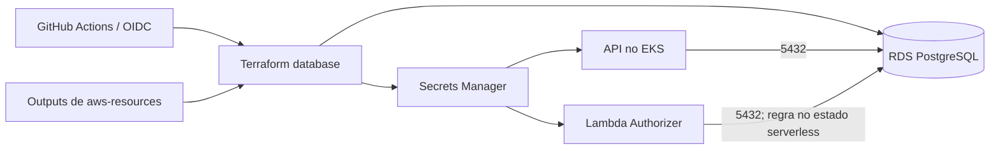

# FIAP Tech Challenge — Database

Este repositório contém exclusivamente a infraestrutura Terraform do banco de dados do projeto.

## Recursos

- instância PostgreSQL no Amazon RDS;
- security group para acesso a partir dos nós do EKS;
- credenciais da aplicação no AWS Secrets Manager.

Os arquivos ficam em [`infra/database`](infra/database). O estado remoto continua usando a chave `terraform/database/terraform.tfstate`, portanto a mudança de repositório não exige migração do state.

## Dependência

Este estado lê os outputs de `aws-resources`, mantido no repositório `fiap-tech-challenge-infra`. Na primeira implantação, respeite a ordem:

```text
infra/bootstrap → infra/aws-resources → database → infra/kubernetes-addons → infra/kubernetes-configs
```

## Uso

Crie `infra/database/terraform.tfvars` sem versioná-lo:

```hcl
db_username = "usuario_do_banco"
db_password = "uma_senha_forte"
```

Depois execute:

```powershell
terraform -chdir=infra/database init
terraform -chdir=infra/database fmt -check
terraform -chdir=infra/database validate
terraform -chdir=infra/database plan -out=.terraform/tfplan
terraform -chdir=infra/database apply .terraform/tfplan
```

O RDS está configurado com `skip_final_snapshot = true`; revise qualquer plano de destruição com atenção.

## GitHub Actions

Este repositório contém sua própria action reutilizável `terraform-stage.yml` e dois workflows de alto nível:

- `apply-database.yml`, para planejar e aplicar automaticamente a criação ou atualização do banco;
- `destroy-database.yml`, para planejar e destruir o banco sem aprovação manual adicional.

Ambos podem ser chamados pelo orquestrador do repositório da aplicação ou iniciados manualmente neste repositório. Configure `DATABASE_ACTION_ROLE`, `db_username` e `db_password` nos repositórios que iniciarem os fluxos. O ARN da role é o output `github_actions_infra_role_arn["database_infra"]` do bootstrap.

Para repositórios privados, configure também `REPOSITORIES_TOKEN` com acesso de leitura. As configurações do GitHub Actions devem permitir que os workflows reutilizáveis sejam acessados pelo repositório da aplicação.


## Tecnologias e arquitetura

Terraform, Amazon RDS PostgreSQL, Secrets Manager e GitHub Actions/OIDC. Não há aplicação executável ou Dockerfile neste repositório.



O estágio serverless, no repositório de infraestrutura, adiciona o acesso da Lambda ao security group do banco. A conexão é compartilhada, mas cada aplicação usa seu próprio contexto EF.

## Modelo e contrato da aplicação

O schema e as migrations pertencem à aplicação principal. Consulte o [diagrama ER, relacionamentos e justificativa dos ajustes](https://github.com/Maieru/fiap-tech-challenge/blob/main/docs/arquitetura/banco-de-dados.md) e a [RFC de escolha do PostgreSQL/RDS](https://github.com/Maieru/fiap-tech-challenge/blob/main/docs/RFCs/RFC-002-postgresql-no-amazon-rds.md).

O banco não expõe Swagger/Postman próprio. Seu consumidor possui [OpenAPI local](http://localhost:8080/openapi/v1.json) e [Scalar local](http://localhost:8080/scalar/v1), disponíveis com a API em Development. Para desenvolvimento sem AWS, use o [Compose da aplicação](https://github.com/Maieru/fiap-tech-challenge#execução-local-com-docker-compose).

## Limites da Fase 3

O deploy atual é iniciado manualmente ou pelo orquestrador. Gatilhos de homologação/produção não estão declarados; proteção de branches depende de verificação remota. O RDS não tem backups automáticos e a destruição não cria snapshot final. Consulte os [limites operacionais do banco](https://github.com/Maieru/fiap-tech-challenge/blob/main/docs/arquitetura/banco-de-dados.md#operação).
